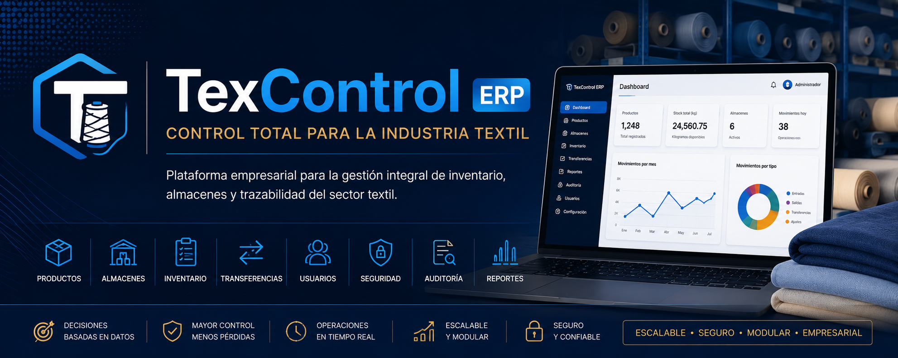

# TexControl

<p align="center">
  
</p>

<p align="center">

**Control total para la industria textil.**

*Plataforma empresarial para la gestión integral de inventario, almacenes y trazabilidad de telas RIB de algodón peinado 100%.*

</p>

<p align="center">
  
  
  
  
  
</p>

---

## 📋 Índice

- [Descripción](#-descripción)
- [Problema](#-problema)
- [Solución](#-solución)
- [Funcionalidades](#-funcionalidades)
- [Tecnologías](#-tecnologías)
- [Arquitectura](#-arquitectura)
- [Instalación](#-instalación)
- [Roadmap](#-roadmap)

---

## 📖 Descripción

**TexControl** es una plataforma empresarial desarrollada con **Java 21** y **Spring Boot**, diseñada para digitalizar la operación de una empresa textil dedicada a la fabricación, teñido y comercialización de telas RIB.

Cubre el flujo completo del negocio: desde que la tela llega teñida de FAST DYE hasta que se distribuye entre almacenes y tiendas, con lectura automática de documentos por IA, trazabilidad total por kardex, y reportes exportables.

---

## 🚨 Problema

La operación textil típica se controla con experiencia, notebooks físicos y hojas de cálculo sueltas, lo que provoca:

- Diferencias entre inventario físico y lo que "se cree" que hay.
- Pérdida de trazabilidad de guías, facturas y programas de teñido.
- Compras de hilo excesivas por falta de información real de stock.
- Dificultad para auditar quién movió qué y cuándo.

## 💡 Solución

TexControl centraliza toda la información en una única plataforma, con recepción validada por conteo físico, transferencias con doble confirmación, y un historial completo que nunca se pierde.

---

## 🚀 Funcionalidades

### 📦 Catálogo
Tipos de tela, títulos, colores (con código FAST DYE), artículos y ubicaciones — con borrado protegido ante relaciones existentes.

### 📥 Recepciones + OCR con IA
Flujo de 4 pasos (documento → conteo físico → validación → confirmación). Las guías y facturas en PDF se leen automáticamente con la API de Anthropic (Claude), extrayendo proveedor, número de guía/factura, fecha y productos, con matching directo contra el catálogo.

### 📊 Stock y Kardex
Stock disponible por ubicación en tiempo real e historial completo de movimientos.

### 🔄 Transferencias
Entre ubicaciones, con doble confirmación (salida → llegada) y reparto de una misma línea entre múltiples destinos.

### 📱 Operación móvil para almacenero
Pantallas de Entrada/Salida rápida con cámara para el personal de almacén, con cola de revisión y aprobación por un SUPERADMIN antes de afectar el stock.

### 📈 Dashboard
Indicadores en tiempo real con acceso directo a cada sección: stock total, stock en almacén principal, transferencias en tránsito, recepciones y revisiones pendientes.

### 📑 Reportes
Stock por ubicación, kardex por rango de fechas, recepciones, transferencias y stock bajo/crítico — todos exportables a Excel.

### 🗄️ Archivo Histórico
Importación masiva de guías y facturas antiguas vía ZIP (con subcarpetas por empresa/año), leídas por IA en segundo plano. Enriquece el catálogo de colores y artículos sin afectar el stock actual — borrado individual y masivo incluido.

### 🔐 Seguridad y Usuarios
Roles SUPERADMIN, GERENTE (solo lectura) y SUPERVISOR (almacén) con Spring Security, gestión completa de usuarios (alta, inactivación, baja protegida) y registro de auditoría de cada acción relevante. Existe además el rol VENDEDOR, reservado para el futuro módulo de Ventas — hoy no tiene permisos asignados en `SecurityConfig`.

---

## 💻 Tecnologías

| Capa | Tecnología |
|---|---|
| Backend | Java 21 · Spring Boot 3 · Spring Security · Spring Data JPA |
| Frontend | Thymeleaf · Bootstrap 5 · Bootstrap Icons |
| Base de datos | MySQL 8 · Flyway |
| IA / OCR | API de Anthropic (Claude) |
| Reportes | Apache POI (Excel) |
| Infraestructura local | Docker (MySQL + Adminer) |

---

## 🏛 Arquitectura

Organización por dominio de negocio, un paquete por módulo, cada uno con el patrón `Controller → Service → Repository → Entity`:
---

## ⚙ Instalación

### 1. Clonar

```bash
git clone https://github.com/Jlynch23/textil-inventario.git
cd textil-inventario
```

### 2. Variables de entorno

El proyecto **no guarda credenciales en el código**. Antes de levantar la base de datos, define:

```bash
export DB_USERNAME=textil_user
export DB_PASSWORD=<contraseña del usuario de la app>
export MYSQL_ROOT_PASSWORD=<contraseña de root de MySQL, DISTINTA de DB_PASSWORD>
export ANTHROPIC_API_KEY=<tu API key de Anthropic>
```

`docker-compose.yml` usa `DB_PASSWORD` para el usuario `textil_user` y `MYSQL_ROOT_PASSWORD` para root — deben ser valores distintos, así una fuga de la credencial de la app no da acceso root a la base de datos.

### 3. Levantar la base de datos

```bash
docker compose up -d
```

MySQL queda en el puerto `3307`, Adminer en el `8081`.

### 4. Ejecutar

```bash
mvn spring-boot:run
```

Las migraciones de Flyway se aplican automáticamente. Disponible en `http://localhost:8080`.

---

## 📈 Roadmap

### Completado

- ✅ Catálogo, Recepciones, Stock, Kardex, Transferencias
- ✅ OCR e IA para lectura automática de guías/facturas
- ✅ Roles y operación móvil para almacenero
- ✅ Dashboard interactivo
- ✅ Reportes exportables a Excel
- ✅ Archivo histórico de documentos con enriquecimiento de catálogo
- ✅ Auditoría y gestión de usuarios
- ✅ Despliegue en producción (VPS) — ver [`DEPLOY.md`](DEPLOY.md)

### Próximas versiones

- 🚧 Módulo de Ventas
- 🚧 Módulo de Créditos
- 🚧 Códigos de barras / QR para trazabilidad individual por rollo
- 🚧 API REST
- 🚧 HTTPS con dominio propio (pasos ya documentados en `DEPLOY.md`, falta el dominio)

## 🔐 Variables de entorno

El proyecto usa variables de entorno para credenciales y configuración (nunca hardcodeadas en el repo, ver `application.yml`). Copiar `.env.example` como referencia y definir los valores reales en `~/.bashrc` (o el gestor de secretos que corresponda en producción):

```bash
DB_USERNAME=textil_user
DB_PASSWORD=          # obligatoria, sin valor por defecto
MYSQL_ROOT_PASSWORD=  # obligatoria, distinta de DB_PASSWORD -- solo para docker-compose y backups
ANTHROPIC_API_KEY=    # para el OCR de guías/facturas
DOCUMENTOS_PATH=./documentos
MAX_UPLOAD_SIZE=25MB
NOMBRE_EMPRESA=Laura & Clemente  # nombre del negocio, bajo el logo TEXCONTROL (personalizable por cliente)
BIND_IP=              # solo produccion (docker-compose.prod.yml): IP a la que se publica nginx -- ver DEPLOY.md
```

## 💾 Backup y restauración de la base de datos

```bash
# Backup manual (genera un .sql.gz con timestamp en ~/backups/textil-inventario/)
./scripts/backup-db.sh

# Restaurar desde un backup (SOBREESCRIBE la base de datos actual)
./scripts/restore-db.sh ~/backups/textil-inventario/textil_inventario_2026-07-17_155514.sql.gz
```

Para automatizar backups diarios, agregar a `crontab -e` (ajustando la ruta del proyecto y la contraseña):
Los backups se conservan 30 días por defecto (configurable en `RETENCION_DIAS` dentro del script); los más antiguos se eliminan automáticamente en cada corrida.

---

## ⭐ Estado del proyecto

**En desarrollo activo.** Nuevas funcionalidades se incorporan continuamente siguiendo una arquitectura modular y escalable.
